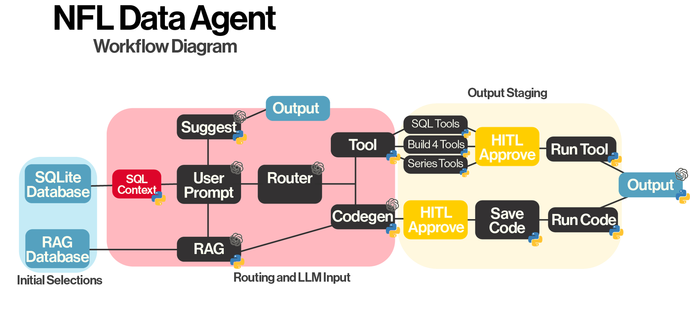
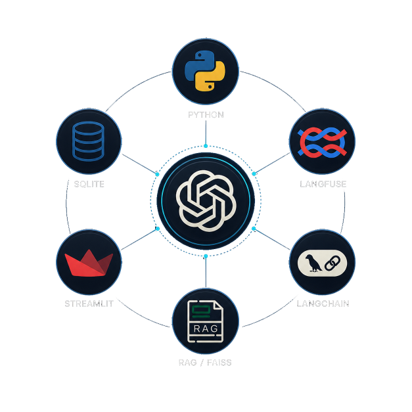

# NFL Data Analysis Agent

> QAC387 Final Project — Final Release

An NFL analytics agent combining LLM routing, SQL-backed analytics, Retrieval-Augmented Generation (RAG), and Human-In-The-Loop (HITL) code execution.

---

## Development

| Name          | GitHub                                            |
| ------------- | ------------------------------------------------- |
| Jacob Poore   | [Jacob-Poore](https://github.com/Jacob-Poore)     |
| Arian Zarazua | [Arian-Zarazua](https://github.com/Arian-Zarazua) |

---

## Deliverables

| Deliverable        | Link                          |
| ------------------ | ----------------------------- |
| Final Presentation | `docs/FinalPresentation.pptx` |
| Final Paper        | `docs/FinalPaper.docx`        |

---

## Core Features

* LLM-based routing between tools and generated Python code
* SQL-backed analytics using SQLite
* Retrieval-Augmented Generation (RAG) with FAISS
* Human-In-The-Loop (HITL) approval workflow
* Interactive Streamlit dashboard
* Automated report and visualization generation

---

## Workflow Diagram



---

## Technology Stack



---

## Repository Structure

```text
builds/        Core agent implementations
scripts/       Streamlit + RAG utilities
data/          NFL datasets
knowledge/     RAG knowledge base
reports/       Generated reports and plots
docs/          Final deliverables
```

---

## Included Data Sources

* Pro Football Reference datasets
* Stat-Savant play-by-play datasets
* Multi-season NFL statistical archives

---

## Build Tools

### Streamlit Interface

Interactive dashboard for prompts, plots, and generated outputs.

```bash
streamlit run scripts/app_streamlit_build4.py
```

### RAG Index Builder

Builds the FAISS vector index used for document retrieval.

```bash
python -m scripts.build_rag_index
```

### Routing Engine

Handles:

* Tool selection
* SQL routing
* RAG integration
* HITL code generation

### SQL Analytics Layer

Included SQLite-backed analysis tools:

* `sql_query`
* `top_categories`
* `grouped_numeric_summary`
* `plot_missingness`

---

## Installation

```bash
pip install -r requirements.txt
```

---

## Environment Configuration

```bash
export OPENAI_API_KEY=your_key
export LANGFUSE_PUBLIC_KEY=your_key
export LANGFUSE_SECRET_KEY=your_key
export LANGFUSE_BASE_URL=http://localhost:3000
```

---

## Running the Agent

### Streamlit Interface

```bash
streamlit run scripts/app_streamlit_build4.py
```

### CLI Usage

```bash
python builds/build4_rag_router_agent.py \
  --data data/Pro-Football-Reference/Stats \
  --report_dir reports \
  --knowledge_dir knowledge \
  --session_id cli-session \
  --memory
```

---

## Agent Commands

| Command          | Description             |
| ---------------- | ----------------------- |
| `help`           | Show available commands |
| `schema`         | Display dataset schema  |
| `ask <request>`  | Automatic routing       |
| `tool <request>` | Force tool execution    |
| `code <request>` | Force code generation   |
| `run`            | Execute approved script |
| `exit`           | Exit the agent          |

---

## Example Requests

```bash
ask plot average passing yards by season
tool top 10 teams by scoring offense
ask generate a trend chart for expected points added
```

---

## Final Improvements

* Improved routing stability
* Expanded SQL integration
* Better report tracking
* Safer backend tool filtering

---

## Known Limitations

| Area                           | Status                 |
| ------------------------------ | ---------------------- |
| Large Dataset Performance      | Ongoing                |
| Generated Code Reliability     | Manual review required |
| Temporal Field Standardization | Planned                |

---

## Future Work

* Improved SQL optimization
* Expanded visualization tooling
* Additional sports dataset support

---

## Security Notice

> [!WARNING]
> Never upload or commit Langfuse logs.
>
> These files may contain sensitive API credentials and may trigger GitHub push protection.
